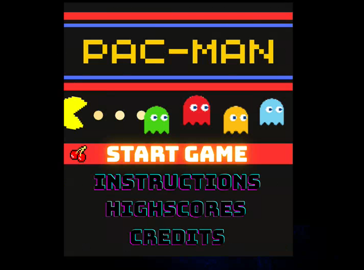
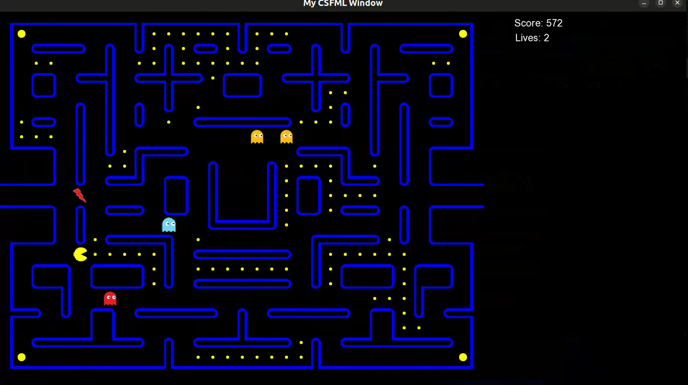

# Multithreaded Pac-Man Game (C + SFML)

This project is a multithreaded recreation of the classic Pac-Man game, developed in **C** using the **SFML** graphics library. It was built as a semester project for the **Operating Systems** course at **FAST NUCES Islamabad, Spring 2025**.

---

## 📌 Project Overview

The game simulates real-time interaction between Pac-Man and multiple ghosts using POSIX threads (`pthreads`). Each major game component runs on its own thread with proper synchronization using **mutexes** and **semaphores**, following classic concurrency patterns.

---

## 🔧 Technologies Used

- **Language**: C 
- **Graphics Library**: SFML
- **Multithreading**: POSIX Threads (pthreads)
- **Synchronization**: Mutexes and Semaphores

---

## 🎮 Features

- Separate threads for:
  - Game Engine
  - User Interface
  - Pac-Man
  - Each Ghost (dynamic ghost generation)
- Shared game board with synchronized access
- Ghost AI (simple or path-following behavior)
- Power pellets and ghost state transitions
- Resource locking for:
  - Ghost house exit permits & keys
  - Speed boost items
- No thread joins or sleep delays – pure synchronization

---

## 📷 Screenshots

### Main Menu  

### In-Game View  

---

## 🚀 Running the Game

### Prerequisites:
- GCC with pthread and SFML support
- SFML installed system-wide (`libsfml-dev` on Linux)
---

## Youtube Demo 
📺 **[Pacman Demo](https://youtu.be/YoEW8AAq3gY)**

### Developed By

- Abdul Basit  
- Ahnaf Abdullah  
- Moeez Abid
